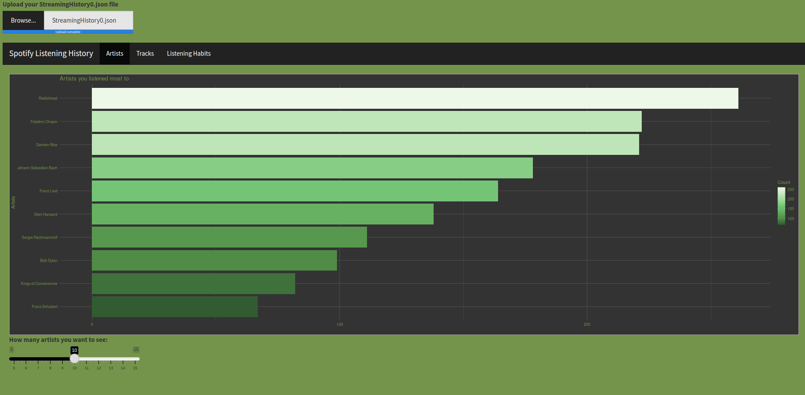
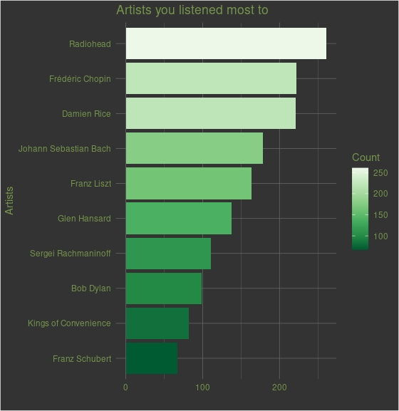
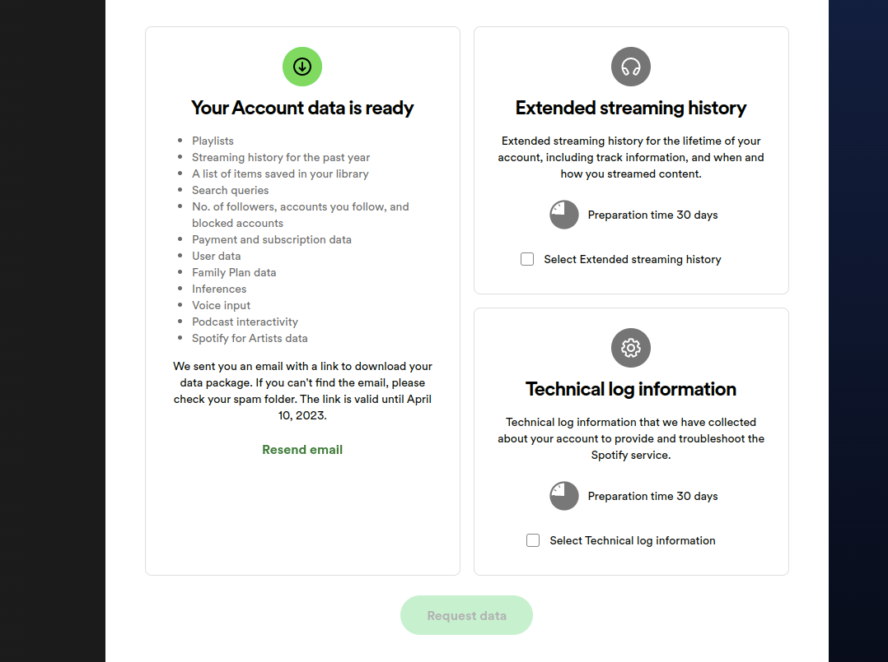

# Analyse Your Spotify Listening

With this Shiny App you can analyse your Spotify data with simple plots. All you have to do is request your data from Spotify!

You can reach the app from [this link](https://ozturkfemre.shinyapps.io/spotify/).

## Preview of the application

## Example Plot

## How can you get your data?

You can follow the steps below to access your Spotifyt listening history:

1.  Log in to your Spotify account.
2.  Go to the [account](https://www.spotify.com/us/account/) page.
3.  Choose *Privacy Settings*.
4.  At the bottom of the page you will see the section titled *Download your data*.
5.  You will see three frames, one on the left and two on the right. You can request your data by marking the frame on the left of these frames. The page would look like the following:

***NOTE:*** It takes few days to get your data via e-mail. Since I get the data, it says that they sent me an email with a link to download my data package.

------------------------------------------------------------------------

As an example, feel free to use my data which you can reach from [this repository](https://github.com/ozturkfemre/spotify.app/tree/main/MyData).
